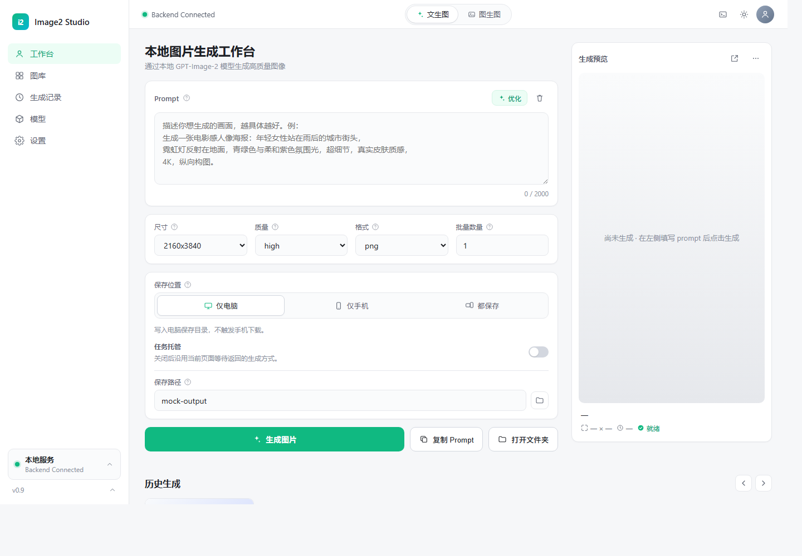

# Image2 Studio Frontend

面向 `gpt-image-2` 工作流的本地图片生成前端。提供文生图、图生图、历史浏览、模型列表、手机访问与任务托管等界面能力；本仓库只发布静态前端，不包含任何私有后端、代理实现、账号凭据或生成记录。

> 重要说明：这里是公开前端拆分版。你需要自己实现 `API_CONTRACT.md` 中的同源 `/api/*` 后端接口，才能真正完成图片生成、保存、手机访问发布和后台任务托管。

---

## 界面预览

<details open>
<summary>桌面端主界面</summary>



</details>

---

## 核心特性

### 强调本地工作流的图片生成界面

- 文生图与图生图双模式切换。
- 支持尺寸、质量、格式、批量数量等常用生成参数。
- 支持参考图拖拽上传、缩略预览与一键移除。
- 生成结果可进入预览区、历史区和图库视图。

### 保存目标与手机端协同

- 支持 `仅电脑`、`仅手机`、`都保存` 三种保存目标。
- 手机模式下可由后端提供临时访问地址，用于同网络或 tailnet 内访问。
- 支持复制手机访问地址、新标签打开、重新发布等前端操作。
- 支持 PWA manifest、应用图标和 service worker，方便移动端添加到主屏幕。

### 任务托管

- 支持把文生图任务提交给后端后台处理。
- 页面可轮询 `/api/tasks/:id` 恢复任务状态。
- 手机端提交后可以切后台或锁屏，等待后端完成后同步结果。
- 图生图仍保留直接生成流程，避免复杂上传任务状态丢失。

### 历史、模型与设置

- 历史生成列表、生成记录表格、图库缩略图和大图预览。
- 模型列表从后端 `/api/models` 获取。
- 设置页支持主题、默认参数、背景图、手机模式和任务托管开关。
- 后端控制入口已抽象为通用 `Backend`，不绑定任何私有代理实现。

---

## 部署与使用

### 方式一：接入你自己的后端

将 `static/` 目录交给你的后端服务，并按 `API_CONTRACT.md` 实现同源接口：

```text
your-backend/
  static/
    index.html
    app.js
    styles.css
    manifest.webmanifest
    sw.js
    icons/
```

推荐从后端根路径打开，例如：

```text
http://127.0.0.1:5180/
```

### 方式二：只预览前端界面

只看 UI 时可以用任意静态服务器托管 `static/`。此模式不会真实生图，因为 `/api/*` 接口不存在或只返回 mock 数据。

```powershell
python -m http.server 5173
```

然后打开：

```text
http://127.0.0.1:5173/static/index.html
```

### 方式三：嵌入已有图片服务

如果你已有图片生成后端，只需要做一层适配，把你的生成接口映射为本仓库约定的：

- `POST /api/generate`
- `POST /api/edit`
- `POST /api/tasks/generate`
- `GET /api/tasks/:id`
- `GET /api/history`
- `GET /api/models`
- `GET /api/mobile/status`

详细字段见 [API_CONTRACT.md](API_CONTRACT.md)。

---

## 隐私边界

本仓库不会发布以下内容：

- API 凭据、账号、密码、token 或本地配置。
- 私有后端、代理实现、模型路由逻辑。
- Tailscale 证书、私钥、辅助脚本、机器名或真实 tailnet 域名。
- 历史生图、Prompt sidecar、日志、构建产物或桌面打包文件。
- 本机绝对路径和个人目录信息。

公开版只保留静态前端资源与接口契约。任何真实生成、鉴权、保存、移动端发布逻辑都应由你自己的后端实现。

---

## 技术栈

- 前端：原生 HTML / CSS / JavaScript。
- UI：单页多视图工作台，无构建步骤即可部署。
- PWA：`manifest.webmanifest`、`sw.js`、多尺寸图标。
- 后端契约：同源 REST API。

---

## Star History

[](https://star-history.com/#DRSFM/image2-frontend-haiku&Date)
